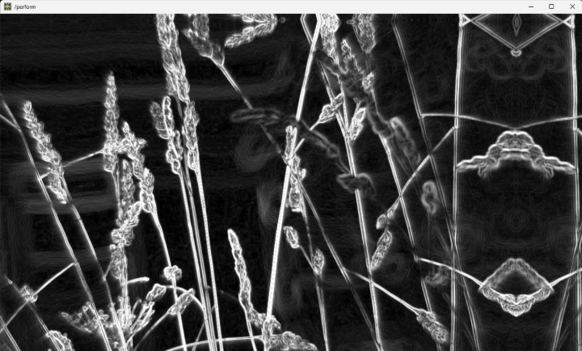
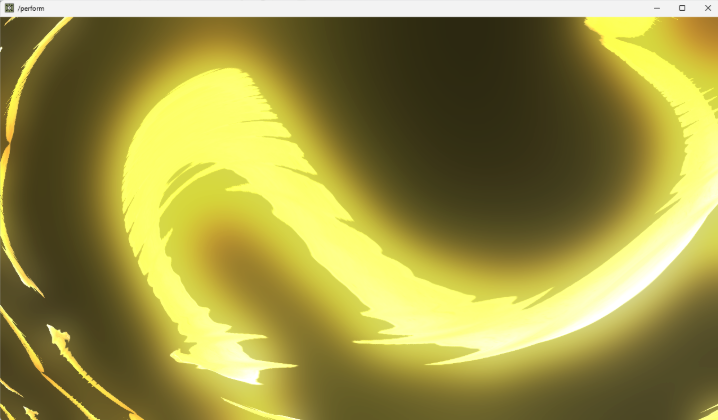
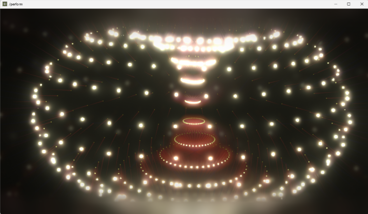
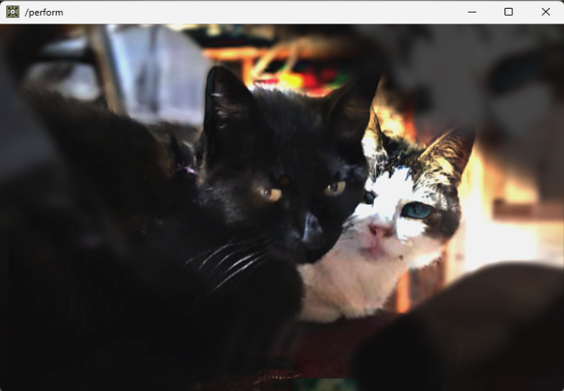
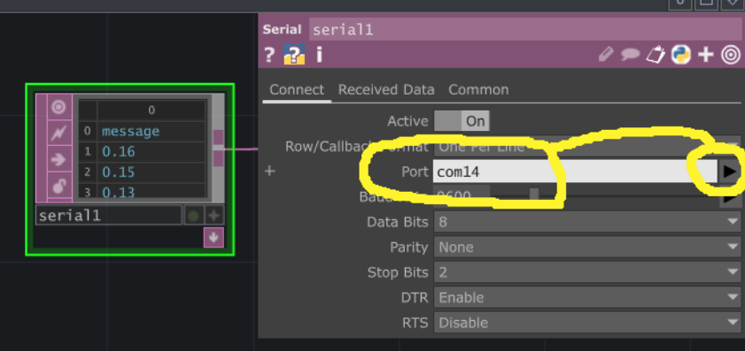

Multimedia II/III - UADE - Ramos/Nievas/Espósito

**Trabajo práctico 1**

---

# *2 Piezas interactivas con ARDUINO y TOUCHDESIGNER*
**Trabajo grupal (2 a 3 personas máximo, sin excepción)**

Los patches (proyectos) de Touchdesigner ya se proveen diseñados y funcionando, no es necesario intervenir en ellos excepto para indicar el puerto Serie donde está conectado Arduino (se explica luego). Solo nos enfocaremos en la parte de diseño conceptual y de implementación en Arduino.

Pueden descargarse los archivos para realizar el TP1 acá: [descargar](https://github.com/JaoRamos/multimedia-uade-juan/raw/refs/heads/main/TPS/Archivos-TP1.zip).

Se aclara la **rúbrica** de puntajes para cada elemento del trabajo.

---

**Consigna** 

1. Se proveen 4 opciones de patches en Touchdesigner, de los cuales **deberán elegirse solo 2** (a gusto de cada grupo\!) y realizar los pasos siguientes.

(capturas de los patches en imágenes y videos breves, el video NO es el patch, es solo un demo breve)

|  |  |  |  |
| :---: | :---: | :---: | :---: |
| [Olas](https://youtu.be/AE75TbHW__I?si=DVa87qp0Tsx6OVu_) | [Banana](https://youtu.be/PD3q_tzNWeg?si=kjKSQKVahAF-d2Ha) | [Toroide](https://youtu.be/y6wEPaHaTio?si=lMxSjsdc5j-rC5rZ) | [Panda y Cambá](https://youtu.be/FYjiVRFY_X4?si=29aptJWjF06tOr6O) |

1. Para cada opción elegida, implementar una interacción que controle el patch de Touchdesigner mediante un sensor (cualquiera de los vistos en clase, también puede ser un botón) conectado al Arduino, y que éste envíe un dato (número) mediante Serial a Touchdesigner. Todos los patches “esperan” un valor con decimales entre 0.0 y 1.0, siendo 0.0 el mínimo y 1.0 el máximo. Cada patch ya contiene programada una interacción distinta y particular, y todos tienen sonido (se puede escuchar con auriculares, parlantes o lo que haya a mano… aunque no es fundamental). **1 punto por pieza.**  
   *Seguramente convenga utilizar un protoboard para garantizar la estabilidad de la conexión.*

2. Para cada sensor elegido, será necesario solucionar en el código una manera de adaptar sus valores producidos al rango que “espera” Touchdesigner en la PC, que siempre es un número entre 0.0 y 1.0. Se puede googlear, mirar los ejemplos de las clases, y consultas a la IA para resolver estos problemas. **0.5 puntos por pieza.**

3. Importante: **no se pueden repetir sensores**, por lo que se deberán escoger 2 sensores distintos para los 2 patches seleccionados. **\-2 puntos si se usa el mismo sensor :(**

4. Realizar un pequeño video (con un celular cualquiera…) donde se vea la pieza funcionando y el sensor con Arduino controlando el patch de Touchdesigner mediante interacción humana. No más de 20 segundos por pieza. No se pide edición ni nada especial, tan solo demostrar que “funciona”. **1 punto por pieza.**

5. Se debe realizar un pequeño escrito, en cualquier software que permita exportar a PDF o Docx, que sea una **memoria descriptiva del trabajo** realizado para cada patch en particular. Esto debe incluir:

   1. Una página/carátula inicial donde consten los nombres de cada integrante del grupo, y se aclare el aporte de cada uno (puede ser el tipo de rol asumido, siendo opcional dividir roles; no se puntuará más ni menos por el rol elegido).  **0.5 puntos total.**

   2. Un título ficticio para cada pieza. **0.25 puntos por pieza.**

   3. Una breve descripción conceptual ficticia para cada pieza, que incluya una justificación (también ficticia) de por qué se eligió ese sensor para esa pieza y estética particular, y una sugerencia de dónde podría instalarse (un espacio a elección, debe existir pero puede ser cualquiera). **1 punto por pieza.**

   4. El listado de materiales necesarios para implementar la pieza (solamente lo relacionado a Arduino, sus sensores y conexiones \- *no hace falta contemplar PC, proyectores, pantallas*…). *Esto es a modo de simulacro, como si fuese un encargo por parte de un cliente y necesitan armar el listado de materiales.* **0.5 puntos por pieza.**

   5. Un dibujo pequeño (puede ser una foto de un papel dibujado, o hecho en cualquier software) que muestre el esquema de conexión que utilizaron para implementar el sensor con Arduino y cualquier componente accesorio necesario (cables, resistores etc…). No olvidar indicar los nombres de los pines utilizados tanto del sensor como del Arduino (solo los utilizados, no hace falta el resto\!). No se permite entregar un esquema descargado de internet, por lo que deberán cuidar que cada pin mostrado sea el correcto. *La idea es aprender a hacer las indicaciones específicas para que otros sigan nuestro diseño.* **0.5 puntos por pieza.**

---

**Elementos a entregar**

1. Memoria descriptiva con todo lo antes descrito (carátula y memorias de cada pieza, todo en el mismo archivo **.pdf** o **.docx**).  
2. Códigos de Arduino de cada pieza (recordar que son archivos **.ino**, 2 en total).  
3. Videos con la interacción Arduino-Touchdesigner (máximo 20 segundos por pieza, 2 en total).

En los archivos del canal de la Clase 5, podrán hacer una carpeta 📂 para cada grupo, cuyo nombre sean sus apellidos (nada mas), donde podrán subir los archivos del TP.

---

## Calificación

Notar que toda la rúbrica suma 10, pero con 1 sola pieza *correctamente realizada* alcanza para aprobar el TP1.

---

## Notas sobre Touchdesigner

Los patches de Touchdesigner descargados funcionarán automáticamente una vez que se les indique el puerto Serie donde está conectado el Arduino (COM1, COM2, etc…), eso se hace en las opciones del operador llamado “serial1” (**Control / Command \+ F abre un buscador**). Podemos tipearlo a mano, o abrir la lista en el botoncito de la derecha (el triángulo).

A veces aparecen dos cosas con nombre similar a "serial1", apretar las flechitas del buscador "< >" hasta que aparezca el que se ve en la foto.

Importante: los puertos Serial (COM1, COM2, etc...) que estamos usando, habitualmente no permiten compartirse entre aplicaciones... por lo que solo la app de Arduino, o Touchdesigner pueden accederlo por separado, pero no en simultaneo... tendremos que deshabilitar uno para que ande el otro (alcanza con cambiar de puerto a cualquier otro, momentaneamente... o bien cerrar directamente la app).

Para ver en **pantalla completa** el patch podemos presionar F1, y ESC para regresar. En algunas notebooks para usar F1, hay que mantener presionada la tecla FN también, aunque depende de cada teclado.
