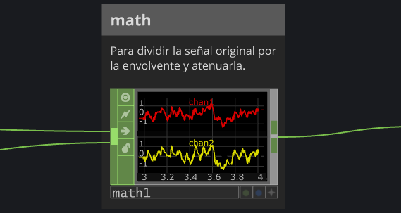
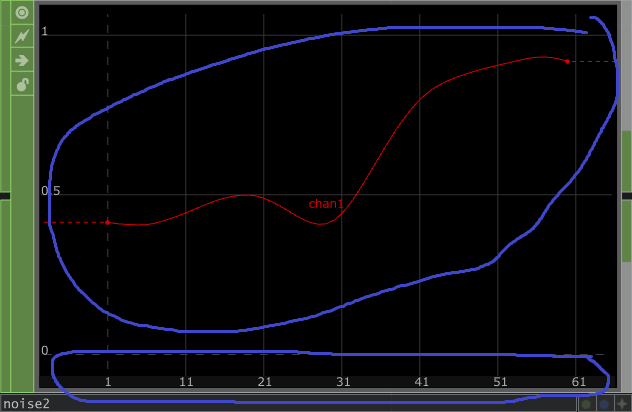
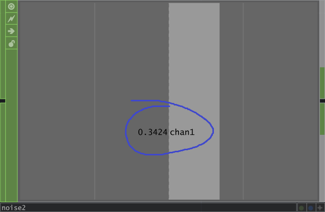

Multimedia II/III - UADE - Ramos/Nievas/Espósito

**Trabajo práctico 2**

---

# **TP2 – Composición visual en TouchDesigner**

**Herramienta:** Touchdesigner (*sin Arduino*)  
**Modalidad:** individual  

---

## **Consigna**

Desarrollar una **composición visual generativa** en Touchdesigner, explorando la relación entre imagen generativa, transformación y control en tiempo real.
La pieza debe concebirse como una obra digital pensada para exhibirse en un espacio de UADE Art (*solo conceptualmente*; no se requiere un emplazamiento real para esta etapa).
Se alienta a experimentar con los distintos operadores para obtener resultados más allá de lo visto en clase.
Solo serán necesarios TOPs y CHOPs, aunque pueden explorarse libremente otras opciones.

---

## **Requisitos generales**

* Desarrollar un **concepto artístico** o poético que guíe la obra (puede basarse en una idea visual, sensación, fenómeno o referencia cultural).
* Desarrollar una memoria descriptiva de la obra, que incluya:
  * Un **título**
  * Una **descripción conceptual**
  * Una descripción de la red de operadores, detallando el rol que cumple cada operador para la intención estética o técnica buscada (*para qué se puso cada operador*). Se pueden describir en la memoria, o bien en la red misma de Touchdesigner (recomendadísimo).
    * *Ver más abajo cómo hacer comentarios descriptivos de los operadores en la red.*
* Se pueden usar imagenes o videos, debiendo mencionarse si es material propio o ajeno (y la fuente en este caso).

---

## **Requisitos mínimos de la red**

* Utilizar **al menos 2 TOPs de fuente/generadores** (los más oscuros) (por ejemplo: *Movie File In, Noise, Ramp, Text*).
* Aplicar **al menos 2  TOPs de procesamiento** (los más claritos) (por ejemplo: *Level, Composite, Feedback, Blur, Transform*).
* Integrar **al menos 1 CHOP** que module parámetros en tiempo real (por ejemplo: *LFO, Noise, Keyboard In, Mouse In*).
* Mantener la red **ordenada y legible**. *Se recomienda renombrar los nodos principales para mejorar la claridad*.

---

## **Entregar**

1. **Archivo .toe** del proyecto en TouchDesigner.
2. **Memoria descriptiva (máx. 2 carillas)** en formato PDF.
3. **Imágenes/videos** en caso de que se utilicen.

---
## **Rúbrica de evaluación**

| **Criterio**                                                                                                                                                                           | **Puntos (máx.)** | **0 – Insuficiente**                                                | **1 – Básico**                                                                     | **2 – Bueno**                                                                                                 | **3 – Destacado**                                                                                                         |
| -------------------------------------------------------------------------------------------------------------------------------------------------------------------------------------- | ------------- | ------------------------------------------------------------------- | ---------------------------------------------------------------------------------- | ------------------------------------------------------------------------------------------------------------- | ------------------------------------------------------------------------------------------------------------------------- |
| **1. Concepto y elaboración artística** (idea visual, coherencia, recursos creativos)                                                                                           | **3 pts**     | No presenta concepto o es irrelevante.                              | Concepto débil o genérico; poco desarrollo estético.                               | Concepto claro y coherente con la composición.                                                                | Propuesta sólida y personal; gran coherencia entre concepto y resultado visual.                                           |
| **2. Descripción de la red y comprensión del proceso**  (incluye claridad y legibilidad de la red)                                                                 | **3 pts**     | No cumple los operadores mínimos requeridos, o no hay descripción.                         | Describe de forma superficial/genérica.                   | Explica adecuadamente la función de los operadores principales.                          | Ofrece una descripción clara, reflexiva y coherente del proceso; conecta lo técnico con lo estético. |
| **3. Creatividad técnica y manejo del entorno** (ingenio en el uso de operadores, solvencia técnica) | **4 pts**     | Patch incompleto o inestable; no demuestra comprensión del entorno. | Uso limitado de operadores, soluciones muy literales. | Resolución técnica adecuada y coherente con la intención visual; demuestra control básico del flujo de datos. | Resolución sólida y creativa; combina operadores con ingenio y claridad técnica para alcanzar resultados originales.      |

* Se valorará el **uso expresivo del control mediante CHOPs**, más allá del simple movimiento automático.
* Ítems valorados como *"0 - Insuficiente"* no otorgan puntos.
* Si dos proyectos son muy similares, podrán ser revisados oralmente.

---

## *Cómo comentar los operadores*

Podemos dejar texto tipo "comentarios" en la red de Touchdesigner mediante varias alternativas.
Una forma que se recomienda probar es usar los operadores **Annotate** (tipo COMP), que permiten dar un título, un texto (body text), y además permiten insertar dentro de ellos un operador cualquiera o incluso varios.
Esto puede servir para dejar comentarios sobre por qué se usa un determinado operador en la red.
El *annotate* no interfiere ni tiene ningún efecto en las conexiones y funcionamiento de la red.

|  |
| :---: |
| Ejemplo de un COMP *Annotate* para comentar sobre el rol de un operador (*math1* en este caso).  Notar como el *math1* se colocó directamente "dentro" del *Annotate*. |
---

## *Arreglar Chops que "saltan"*

A veces nos sucederá que un Chop anda bien, pero lo conectamos a otra cosa y parece que su valor "saltara" cada vez que la línea de tiempo se reinicia a 0.

Ese comportamiento tiene que ver con que muchos Chops producen una serie o *"lista"* de valores por cada canal y frame de animación, en vez de un solo valor, y si el operador que recibe ese dato esperaba un valor único (no una lista) hace comportamientos inesperados.
Por eso vemos la línea roja, como una "historia" de esos valores, porque son una lista realmente.

Podemos forzar al primer operador a generar un único valor por canal activando la opción ***Time Slice*** en su pestaña ***Common***. 

Acá va un ejemplo del mismo Chop Noise con "muchos" vs. "un único valor" por canal:

|  | $->$ |  |
| :---: | :---: | :---: |
| *Noise* con múltiples valores en un canal |  | Mismo *noise* con un único valor por canal |

No debemos confundir este comportamiento de *"lista de muchos valores por canal"* con la idea de tener *"múltiples canales"* (como los ejes *tx ty* del mouse, por ejemplo). Tener esa lista nos puede servir en otras situaciones, como por ejemplo convertirla en una fila o columna de pixels en vez de un único pixel.